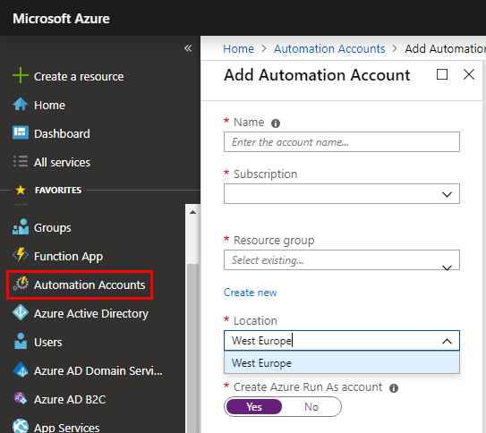
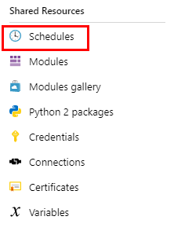
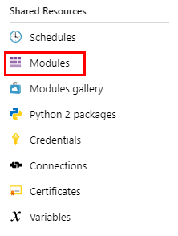
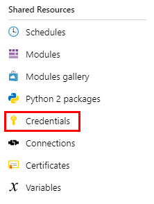
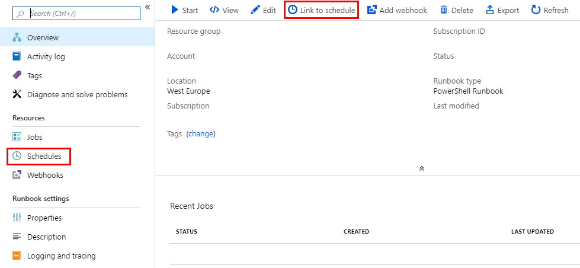
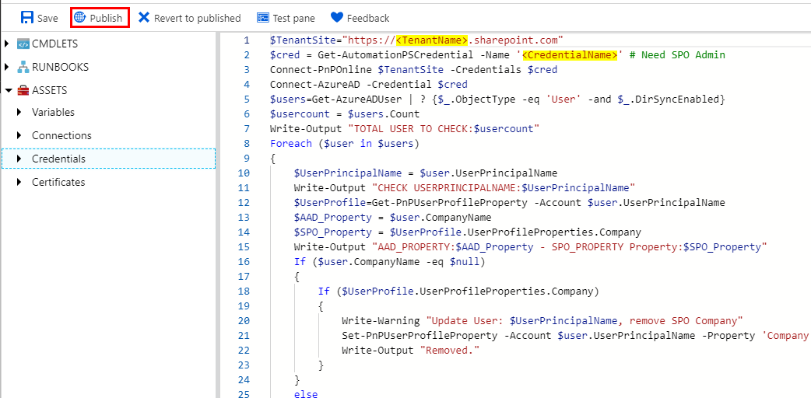

# SPO User Profile Import with an Azure Automation Account
Since SPO AD-Import is limited to a defined set of properties, this sample use an Azure Automation Runbook to Import a desired additional Property (i.e. CompanyName from AzureAD). See also [Information about user profile synchronization in SharePoint Online](https://support.office.com/en-ie/article/information-about-user-profile-synchronization-in-sharepoint-online-177eb196-5887-43c9-84c3-b98a43d35129)

To Import AAD extension attributes, replace the line
```
$AAD_Property = $user.CompanyName
```
with
```
$AAD_Property = (Get-AzureADUserExtension -ObjectId $UserPrincipalName).extension_<id>_<name>
```
*to quickly get the extension "id" and "name" use MS Graph, i.e. https://graph.microsoft.com/beta/Users/user@contoso.com*

### Prerequisites
The Script need to run as SPO Admin user.

### Installing

#### Create an Azure Automation Account


#### Create a Schedule


#### Import Modules

* AzureAD
* SharePointPnPPowerShellOnline



#### Add credentials to use in script


#### Create a Runbook of Type PowerShell and link it to the scheduler


#### Edit, adjust and Publish the Runbook

Adjust *TenantName* and *CredentialName*

```
$TenantSite="https://<TenantName>.sharepoint.com"
$cred = Get-AutomationPSCredential -Name '<CredentialName>'
```



#### Run the Runbook
*For a better reading, Changes will be logged also as Warnings*

